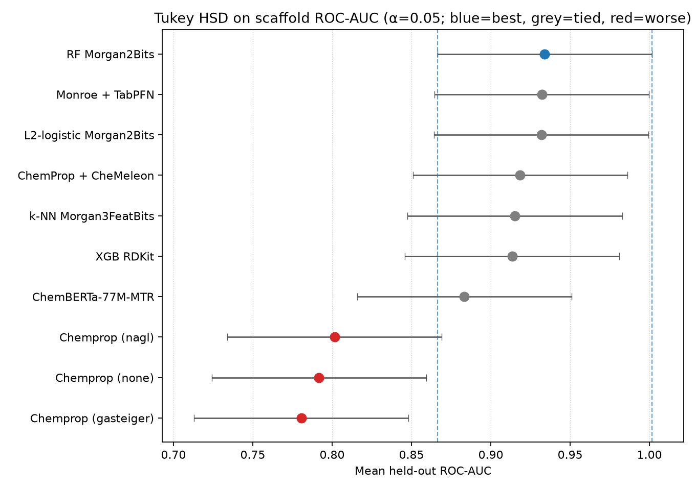

# pfpkg 100 nM haemozoin models (10 seeds)

Held-out test metrics, seeds 42–51 (`n_rep=10`). Ranking uses ROC-AUC and PR-AUC as **mean ± sample std** (`ddof=1`, n=10). F1 and accuracy are at a fixed 0.5 threshold. Assay is 100 nM haemozoin (β-haematin) binary labels, not whole-cell *P. falciparum*.

Fingerprint models used a **fixed recipe** unless noted: no TPE / k-fold CV. XGB early-stops on an inner val slice of **train**. RF fits 200 trees with `class_weight="balanced"`. Tanimoto *k*-NN is *k*=5 with Jaccard distance on binary bits (1 − Tanimoto) and distance weights. L2-logistic is `C=1`, balanced class weights, `lbfgs`. The default saved artifact is Morgan2FeatBits (`model.ubj` / `model.joblib`); every fingerprint was still scored. Chemprop charges were reused from the parent `charges/` cache. CheMeleon initialises Chemprop message passing from the Zenodo foundation weights (no charges). Monroe keeps a frozen 720-d encoder and fits TabPFN in-context on train embeddings only (shared `features/monroe_embeddings.npz`).

After the fixed-recipe ranking, the **best scaffold fingerprint per tree architecture** (RF Morgan2Bits, XGB RDKit) was TPE-tuned (`max_evals=50`, train-fold ROC-AUC only) into `{arch}_scaffold_hpo/seed_{n}`. Fingerprint identity was chosen from the fixed-recipe **test** leaderboard, then HPO was train-only on the same seeded scaffold splits. Chemprop, CheMeleon, ChemBERTa, Monroe, *k*-NN, and logistic were not tuned.

A **y-scramble** of every suite job (train labels permuted, test labels real, no HPO) was written to `{arch}_{split}[_charge]_yscramble/seed_{n}`. `cleaned.parquet` still holds the assay labels; the permutation is in-memory at fit time.

Replicates live under `{architecture}_{split}[_charge][_hpo][_yscramble]/seed_{n}/`. Sources: `comparison.md` / `comparison.json` from `contrib/pfpkg/compare_runs.py`. Foundation-model arms follow the Walters / ExpansionRx comparison pattern ([blog](https://patwalters.github.io/Let-the-Agents-Do-the-Benchmarking/)); the assay here remains binary 100 nM haemozoin, not ADMET regression.

## Random-split fingerprint models are not candidates

Random-split RF and *k*-NN (`n_train=284`, `n_test=72` every seed) are analogue-leakage diagnostics, not chemotype-generalisation scores. Close analogues can sit in both train and test.

The RF reference is the **best scaffold RF**, Morgan2Bits (0.9340 ± 0.0273 ROC, `n_test` ≈ 63). The *k*-NN reference is the **best scaffold *k*-NN**, Morgan3FeatBits (0.9151 ± 0.0463). Δ is random-split mean minus that architecture's scaffold reference. Test size and class mix differ, so this is a diagnostic, not a ranking.

| Random fingerprint | ROC-AUC | vs scaffold reference | Δ ROC | Δ PR | Δ weighted F1 @0.5 |
|---|---|---|---|---|---|
| RF Morgan2FeatBits | 0.9197 ± 0.0274 | RF Morgan2Bits 0.9340 ± 0.0273 | −0.0143 | −0.0180 | −0.0082 |
| RF Morgan2Bits | 0.9195 ± 0.0318 | RF Morgan2Bits 0.9340 ± 0.0273 | −0.0145 | −0.0128 | +0.0014 |
| RF AtomPair | 0.9180 ± 0.0346 | RF Morgan2Bits 0.9340 ± 0.0273 | −0.0160 | −0.0151 | −0.0104 |
| RF Morgan3Bits | 0.9180 ± 0.0314 | RF Morgan2Bits 0.9340 ± 0.0273 | −0.0160 | −0.0145 | +0.0014 |
| RF Morgan3FeatBits | 0.9180 ± 0.0310 | RF Morgan2Bits 0.9340 ± 0.0273 | −0.0160 | −0.0180 | −0.0096 |
| RF RDKit | 0.9071 ± 0.0364 | RF Morgan2Bits 0.9340 ± 0.0273 | −0.0269 | −0.0188 | −0.0103 |
| *k*-NN RDKit | 0.9063 ± 0.0374 | *k*-NN Morgan3FeatBits 0.9151 ± 0.0463 | −0.0089 | −0.0008 | −0.0037 |
| *k*-NN Morgan3FeatBits | 0.8996 ± 0.0316 | *k*-NN Morgan3FeatBits 0.9151 ± 0.0463 | −0.0156 | −0.0266 | +0.0005 |
| *k*-NN AtomPair | 0.8945 ± 0.0385 | *k*-NN Morgan3FeatBits 0.9151 ± 0.0463 | −0.0206 | −0.0226 | +0.0020 |
| *k*-NN Morgan2Bits | 0.8938 ± 0.0343 | *k*-NN Morgan3FeatBits 0.9151 ± 0.0463 | −0.0213 | −0.0199 | −0.0092 |
| *k*-NN Morgan2FeatBits | 0.8932 ± 0.0380 | *k*-NN Morgan3FeatBits 0.9151 ± 0.0463 | −0.0219 | −0.0330 | −0.0023 |
| *k*-NN Morgan3Bits | 0.8927 ± 0.0273 | *k*-NN Morgan3FeatBits 0.9151 ± 0.0463 | −0.0224 | −0.0183 | −0.0091 |

Random RF and random *k*-NN both sit **below** their scaffold references (about 0.01–0.027 ROC) — inside seed error, and in the direction opposite a leakage story that would inflate random above scaffold. Rankings below still use **scaffold** only. Source: `comparison.md` “Random split vs best scaffold (reference)”.

Y-scramble of the same random splits also falls to ~0.50 ROC (RF Morgan2Bits 0.5084 ± 0.1281; *k*-NN Morgan2Bits 0.5083 ± 0.1258). Close analogues in both splits do not by themselves produce a ranking once train labels are noise.

## Scaffold ranking

Mean `n_train` ≈ 293, mean `n_test` ≈ 63 (scaffold groups move the split size; seed 45 had 102 test compounds). NAGL Chemprop is one train molecule shorter on average (`n_train` 291.8).

Tukey HSD on held-out ROC-AUC (fixed-recipe scaffold; best fingerprint per tree architecture; α = 0.05). Blue = best mean; grey = not significantly different from best; red = significantly worse. Dashed lines mark the best method's simultaneous CI. Source: `scaffold_roc_tukey.png` from `write_comparison_report`.

| Model | ROC-AUC | PR-AUC | Weighted F1 @0.5 |
|---|---|---|---|
| RF Morgan2Bits | 0.9340 ± 0.0273 | 0.9428 ± 0.0231 | 0.8650 ± 0.0462 |
| RF Morgan2FeatBits (saved default) | 0.9332 ± 0.0289 | 0.9390 ± 0.0308 | 0.8608 ± 0.0564 |
| Monroe + TabPFN | 0.9322 ± 0.0243 | 0.9447 ± 0.0171 | 0.8693 ± 0.0482 |
| L2-logistic Morgan2Bits | 0.9319 ± 0.0254 | 0.9428 ± 0.0264 | 0.8555 ± 0.0362 |
| RF Morgan3Bits | 0.9315 ± 0.0257 | 0.9441 ± 0.0229 | 0.8694 ± 0.0463 |
| L2-logistic Morgan3Bits | 0.9296 ± 0.0260 | 0.9407 ± 0.0262 | 0.8713 ± 0.0287 |
| RF Morgan3FeatBits | 0.9284 ± 0.0317 | 0.9366 ± 0.0351 | 0.8569 ± 0.0455 |
| L2-logistic RDKit | 0.9281 ± 0.0328 | 0.9409 ± 0.0272 | 0.8524 ± 0.0378 |
| L2-logistic Morgan3FeatBits | 0.9245 ± 0.0363 | 0.9358 ± 0.0383 | 0.8401 ± 0.0587 |
| RF RDKit | 0.9230 ± 0.0315 | 0.9403 ± 0.0280 | 0.8470 ± 0.0388 |
| L2-logistic Morgan2FeatBits (saved default) | 0.9203 ± 0.0334 | 0.9319 ± 0.0358 | 0.8521 ± 0.0530 |
| RF AtomPair | 0.9199 ± 0.0305 | 0.9309 ± 0.0230 | 0.8625 ± 0.0483 |
| ChemProp + CheMeleon | 0.9185 ± 0.0302 | 0.9342 ± 0.0255 | 0.8504 ± 0.0432 |
| Tanimoto *k*-NN Morgan3FeatBits | 0.9151 ± 0.0463 | 0.8958 ± 0.0561 | 0.8467 ± 0.0670 |
| XGB RDKit | 0.9135 ± 0.0306 | 0.9300 ± 0.0342 | 0.8318 ± 0.0524 |
| L2-logistic AtomPair | 0.9126 ± 0.0402 | 0.9275 ± 0.0285 | 0.8456 ± 0.0702 |
| Tanimoto *k*-NN Morgan3Bits | 0.9124 ± 0.0278 | 0.9088 ± 0.0228 | 0.8374 ± 0.0537 |
| Tanimoto *k*-NN RDKit | 0.9119 ± 0.0400 | 0.9041 ± 0.0454 | 0.8268 ± 0.0670 |
| XGB Morgan3Bits | 0.9115 ± 0.0317 | 0.9188 ± 0.0373 | 0.8546 ± 0.0405 |
| XGB Morgan2Bits | 0.9102 ± 0.0309 | 0.9134 ± 0.0339 | 0.8391 ± 0.0435 |
| Tanimoto *k*-NN Morgan2FeatBits (saved default) | 0.9084 ± 0.0423 | 0.8900 ± 0.0515 | 0.8470 ± 0.0595 |
| Tanimoto *k*-NN Morgan2Bits | 0.9067 ± 0.0311 | 0.9001 ± 0.0220 | 0.8295 ± 0.0642 |
| Tanimoto *k*-NN AtomPair | 0.9061 ± 0.0378 | 0.8937 ± 0.0375 | 0.8223 ± 0.0575 |
| XGB AtomPair | 0.9013 ± 0.0413 | 0.9157 ± 0.0359 | 0.8260 ± 0.0544 |
| XGB Morgan2FeatBits (saved default) | 0.8939 ± 0.0568 | 0.8900 ± 0.0708 | 0.8246 ± 0.0783 |
| XGB Morgan3FeatBits | 0.8904 ± 0.0626 | 0.8833 ± 0.1096 | 0.8260 ± 0.0631 |
| ChemBERTa-77M-MTR | 0.8833 ± 0.0560 | 0.8850 ± 0.0533 | 0.7725 ± 0.1174 |
| Chemprop NAGL | 0.8015 ± 0.1060 | 0.7970 ± 0.1325 | 0.7039 ± 0.1315 |
| Chemprop none | 0.7917 ± 0.1033 | 0.7861 ± 0.1188 | 0.6738 ± 0.1526 |
| Chemprop Gasteiger | 0.7805 ± 0.1112 | 0.7767 ± 0.1231 | 0.6656 ± 0.1536 |

## L2-logistic (fingerprint)

Linear bit model on the same RDKit fingerprints as RF / XGB / *k*-NN. Fixed `C=1`, `class_weight="balanced"`, no HPO.

On scaffold, five of six fingerprints land in ROC 0.920–0.932 with std ≈ 0.03 — the same band as RF. Morgan2Bits (0.9319 ± 0.0254) is within 0.002 of the best RF row. AtomPair is the only logistic fingerprint that drops into the XGB / *k*-NN band (0.9126). Weighted F1 at 0.5 is strongest for Morgan3Bits (0.8713 ± 0.0287), slightly ahead of RF.

**Merits.** A linear control that **matches the forest**. Most of the held-out ranking is additive substructure in the hashed bits, not tree interactions. Cheap, deterministic given the seed, and the coefficients are inspectable. Seed scatter is as tight as RF.

**Limits.** Still a hashed fingerprint, not a graph. Probability at 0.5 is a triage cutoff, not an IC50. Matching RF here is a dataset finding: do not assume logistic will tie the forest on a new assay.

## Tanimoto *k*-NN (fingerprint)

Five nearest neighbours by Jaccard distance on binary fingerprints (cheminformatics Tanimoto), votes weighted by inverse distance.

Scaffold ROC 0.906–0.915. That sits with XGB (0.890–0.914) and **below** RF / logistic by about 0.02 ROC — comparable to seed error, so not a separate league, but the mean gap is consistent across fingerprints. PR-AUC (0.890–0.909) is clearly weaker than RF / logistic (~0.93–0.94): neighbour voting ranks less sharply than a fitted bit model.

**Merits.** The analogue-interpolation baseline. If it had matched RF, the assay would be “nearest labelled neighbour.” It does not quite: RF / logistic pull ahead, so there is some additive SAR beyond lookup. Training is storing the train fingerprints. Y-scramble falls to chance, so the real-label *k*-NN is not a split artifact.

**Limits.** No SHAP path. *k*=5 is a fixed recipe, not tuned. Distance-weighted votes can be dominated by a single identical (or near-identical) neighbour. Use it as a control, not the triage model, unless a new dataset shows it catching the trees.

## Random forest (fingerprint)

Bagged trees on the same RDKit fingerprints as the other fingerprint models. Fixed 200 trees, `max_features="sqrt"`, balanced class weights, no HPO.

On scaffold, all six fingerprints land in ROC 0.920–0.934 with std ≈ 0.03. Gaps are smaller than seed error: **fingerprints are not a ranking**. Morgan bit vectors (radius 2 and 3) share the highest means; AtomPair is a hair lower. The saved default (Morgan2FeatBits) is among the best RF rows, unlike XGB where that default is mid-pack.

**Merits.** Still among the strongest held-out numbers, but no longer alone: L2-logistic occupies the same band. Class weighting matches a small, imbalanced 100 nM label. Training is seconds per fingerprint once features are cached. SHAP / bit-to-atom maps still apply. Seed scatter is tighter than Chemprop and similar to logistic.

**Limits.** A tuned forest on the same splits did **not** beat this recipe (see HPO below). Probability at 0.5 is a triage cutoff, not an IC50. Hashed fingerprints cannot express long-range graph context that Chemprop is designed for — they just happen to be the better representation *on this n*. The RF–logistic tie means the extra tree capacity is not what is driving the score.

## XGBoost (fingerprint)

Same fingerprints, `max_evals=0` (fixed booster + early stop on inner train val). Scaffold ROC 0.890–0.914.

**Merits.** Still a solid fingerprint model, now overlapping Tanimoto *k*-NN rather than sitting just under RF. The unused TPE path (`max_evals>=1`) is the one place this codebase can spend compute on HPO. Early stopping can shrink trees on tiny train folds. Artifact format (`model.ubj`) and SHAP path are mature.

**Limits.** With this recipe RF and logistic are ahead on every fingerprint (about 0.02–0.04 ROC vs RF). Feature-Morgan variants are noisier (Morgan3FeatBits PR std 0.11). The saved Morgan2FeatBits default is **not** the best XGB row; it is protocol, not a winner. TPE on RDKit (below) does not close the RF / logistic gap.

## HPO vs fixed recipe

TPE, 50 evals, 5-fold stratified ROC-AUC on **train rows only**. Test was never the selector. Δ is HPO mean minus the matching fixed-recipe identifier/split (`comparison.md` HPO table). *k*-NN and logistic were not given TPE.

| Model | ROC-AUC fixed | ROC-AUC HPO | Δ ROC | Δ PR | Δ weighted F1 @0.5 |
|---|---|---|---|---|---|
| RF Morgan2Bits | 0.9340 ± 0.0273 | 0.9279 ± 0.0288 | −0.0061 | −0.0036 | −0.0090 |
| XGB RDKit | 0.9135 ± 0.0306 | 0.9152 ± 0.0330 | +0.0017 | +0.0035 | +0.0003 |

Both deltas sit well inside seed error (~0.03 ROC). **Tuning did not change the ranking.** RF HPO is a small test *drop*: train-fold TPE overfit a forest that was already well specified (200 trees, balanced, `max_features="sqrt"`). XGB HPO is a rounding-error *gain*. Keep the fixed recipes for triage; the `_hpo` dirs are a negative control, not a replacement.

The XGB search space used here is sized for this n (`alpha` 0–10, `gamma` 0–5, `lambda` 0.1–10). A leftover range (`alpha` 10–200) collapses CV AUC to 0.5 on ~290 compounds and is not a fair HPO.

Chemprop, CheMeleon, ChemBERTa, Monroe, *k*-NN, and logistic were not given TPE. That would be a different compute budget, not a missing Δ in this table.

## Y-scramble (train labels permuted)

Same frozen splits as the matching fixed recipe. **Train** labels were shuffled among train compounds; **test** labels stay the 100 nM assay. No TPE. Δ is scramble mean minus real-label mean (`comparison.md` y-scramble table). A model that used real structure–activity should drop toward chance (ROC ≈ 0.5).

Scaffold rows (all 10 seeds):

| Model | ROC-AUC real | ROC-AUC scramble | Δ ROC | Δ PR | Δ weighted F1 @0.5 |
|---|---|---|---|---|---|
| RF Morgan2Bits | 0.9340 ± 0.0273 | 0.4657 ± 0.1381 | −0.4683 | −0.4065 | −0.4319 |
| RF Morgan2FeatBits | 0.9332 ± 0.0289 | 0.4403 ± 0.1100 | −0.4930 | −0.4312 | −0.4293 |
| Monroe + TabPFN | 0.9322 ± 0.0243 | 0.4698 ± 0.1050 | −0.4624 | −0.4286 | −0.5286 |
| L2-logistic Morgan2Bits | 0.9319 ± 0.0254 | 0.4823 ± 0.1385 | −0.4496 | −0.3861 | −0.3825 |
| L2-logistic Morgan3Bits | 0.9296 ± 0.0260 | 0.4847 ± 0.1417 | −0.4449 | −0.3845 | −0.4004 |
| ChemProp + CheMeleon | 0.9185 ± 0.0302 | 0.5091 ± 0.1868 | −0.4094 | −0.3823 | −0.4373 |
| Tanimoto *k*-NN Morgan3FeatBits | 0.9151 ± 0.0463 | 0.4606 ± 0.1015 | −0.4545 | −0.3717 | −0.3829 |
| Tanimoto *k*-NN Morgan3Bits | 0.9124 ± 0.0278 | 0.4834 ± 0.1302 | −0.4290 | −0.3774 | −0.3728 |
| XGB RDKit | 0.9135 ± 0.0306 | 0.5524 ± 0.1044 | −0.3611 | −0.3109 | −0.3080 |
| XGB Morgan3Bits | 0.9115 ± 0.0317 | 0.5248 ± 0.1550 | −0.3867 | −0.3421 | −0.3536 |
| ChemBERTa-77M-MTR | 0.8833 ± 0.0560 | 0.5214 ± 0.1787 | −0.3620 | −0.3320 | −0.3833 |
| Chemprop NAGL | 0.8015 ± 0.1060 | 0.3911 ± 0.1160 | −0.4104 | −0.3256 | −0.4004 |
| Chemprop none | 0.7917 ± 0.1033 | 0.3749 ± 0.1250 | −0.4168 | −0.3255 | −0.3749 |
| Chemprop Gasteiger | 0.7805 ± 0.1112 | 0.3676 ± 0.1079 | −0.4129 | −0.3260 | −0.3666 |

Every architecture loses ~0.36–0.49 ROC. Trees, logistic, *k*-NN, Monroe, CheMeleon, and ChemBERTa land on chance (RF / logistic / *k*-NN / Monroe slightly below 0.5; CheMeleon 0.51 ± 0.19 overlaps 0.5). From-scratch Chemprop falls **below** chance and almost never calls the active class at 0.5 (`f1_1` ≈ 0.05): a D-MPNN fit on noise collapses toward inactive scores that anti-rank the real test labels. That is not leftover SAR; it is a broken predictor.

The real-label ranking is therefore label-dependent, not an artifact of scaffold split geometry or hashed fingerprints reconstructing the split. Y-scramble artifacts are a negative control — do not use them for predict.

## ChemBERTa (SMILES transformer)

Frozen DeepChem/ChemBERTa-77M-MTR, no fingerprints, no charges.

**Merits.** Competitive with XGB (ROC 0.883 ± 0.056) without choosing a fingerprint. Useful if you want a SMILES-native model for transfer or for structures that hash poorly. No charge backend.

**Limits.** 0.5-threshold F1 (0.773 ± 0.117) is clearly worse than RF / logistic (~0.86) and XGB / *k*-NN (~0.83). Seed 45 (`n_test=102`) collapses accuracy to 0.52 — the same hard scaffold split that hurts Chemprop. Frozen encoder + small n is a capacity mismatch, not a haemozoin-specific finding. Heavier than trees; needs the `dl` extra.

## Monroe + TabPFN (frozen graph foundation)

Frozen Monroe GRIT encoder (720-d embeddings) with TabPFN v3 in-context classification — no gradient fine-tuning. Protocol matches Walters’ ExpansionRx arm; embeddings are cached once under `features/monroe_embeddings.npz`. Needs `MONROE_HOME` + `TABPFN_TOKEN` (see `.local.env.example`).

**Merits.** Ties the top of the board: ROC 0.9322 ± 0.0243, PR 0.9447 ± 0.0171, weighted F1 0.8693 ± 0.0482 — within seed error of RF Morgan2Bits and logistic Morgan2Bits, with the tightest PR std among the leaders. No fingerprint choice and no Chemprop training loop. Y-scramble drops to 0.47 ROC (−0.46), so the real-label score is label-dependent.

**Limits.** External checkout + licence-gated TabPFN weights. Conformer featurization and TabPFN are heavier than trees. Predictions re-run in-context TabPFN from the saved support set (no conventional `model.ubj`). Still a triage probability for 100 nM haemozoin, not potency.

## ChemProp + CheMeleon (foundation fine-tune)

Same Chemprop D-MPNN trainer as the from-scratch arms, but message passing is initialised from CheMeleon Zenodo weights and fine-tuned with a new binary FFN (no atom charges).

**Merits.** ROC 0.9185 ± 0.0302 / PR 0.9342 ± 0.0255 — about **+0.12 ROC** vs from-scratch Chemprop (~0.78–0.80) and squarely in the RF AtomPair / logistic Morgan2FeatBits band. Foundation init is what makes the graph model competitive on this n. Y-scramble lands on chance (0.51 ± 0.19).

**Limits.** Still below Monroe and the best RF / logistic rows by ~0.01–0.015 ROC (inside seed noise vs mid-pack fingerprints, not vs the top). Larger checkpoints and longer CPU/GPU train than trees. Do not confuse with from-scratch Chemprop in the ranking table.

## Chemprop (D-MPNN, from scratch)

Graph messages on the molecular graph; optional Gasteiger or NAGL atom charges. No foundation init.

**Merits.** The architecture that *should* see haem-binding motifs as bonded environments rather than hashed bits. NAGL is the chemically nicest charge extra. Train/predict stay aligned via the SMILES-keyed charge cache.

**Limits.** Weakest and least stable among non-foundation graph/SMILES models: ROC ~0.78–0.80 ± 0.10. None / Gasteiger / NAGL **overlap completely** — charges do not improve ranking. Seed 51 drops to ~0.59 ROC across charge methods; seed 45 (`n_test=102`) is also poor. A D-MPNN on ~290 compounds is underdetermined relative to RF or logistic on 2048-bit fingerprints — unless CheMeleon-initialised (above). Use from-scratch Chemprop here as a negative control on “graphs will win,” not as the triage model.

## Across architectures (scaffold)

- **Ranking:** RF fingerprints ≈ Monroe + TabPFN ≈ L2-logistic (≈0.92–0.93) ≳ ChemProp + CheMeleon ≈ RF AtomPair (≈0.92) ≳ Tanimoto *k*-NN ≈ XGB (≈0.89–0.92) ≳ ChemBERTa (0.88) > from-scratch Chemprop (≈0.79). Monroe sits inside the RF / logistic band; CheMeleon lifts Chemprop into the mid fingerprint pack.
- **What the new controls add:** logistic matching RF means the SAR is largely **linear in the bits**. Monroe matching that band with a frozen foundation + TabPFN shows a strong pretrained representation without tree HPO. CheMeleon shows foundation init is required for Chemprop to compete here; from-scratch graphs do not.
- **0.5-threshold F1:** logistic Morgan3Bits, RF Morgan3Bits, and Monroe are strongest (~0.87); RF / logistic / CheMeleon generally ~0.85–0.87; XGB / *k*-NN next; ChemBERTa and from-scratch Chemprop are not usable as a 0.5 classifier without retuning the threshold.
- **Fingerprints and charges:** not separable once seed error is included. Do not pick Morgan2 vs RDKit vs NAGL from 0.01–0.02 mean differences.
- **HPO:** TPE on the best fixed-recipe scaffold fingerprint does not move RF or XGB outside seed noise. Persist the **fixed** scaffold RF or logistic (Morgan2FeatBits default is still among the best RF rows), or Monroe if the TabPFN / Monroe stack is available. Tuned RDKit XGB is not a new winner. Treat probabilities as a ranking for azole-related haemozoin inhibition at 100 nM, not potency.
- **Y-scramble:** permuting train labels (test labels real) drops every architecture by ~0.36–0.49 ROC. Trees, logistic, *k*-NN, Monroe, CheMeleon, and ChemBERTa go to chance; from-scratch Chemprop goes below chance by collapsing to inactive. The real-label AUCs are not a split artifact.

0.01–0.03 AUC is not a leaderboard given `n_test` that moves with the scaffold split. Random-split RF and *k*-NN remain leakage diagnostics: use the scaffold Morgan2Bits RF (or logistic Morgan2Bits / Monroe) row as the reference, not as a competitor in the ranking table.
